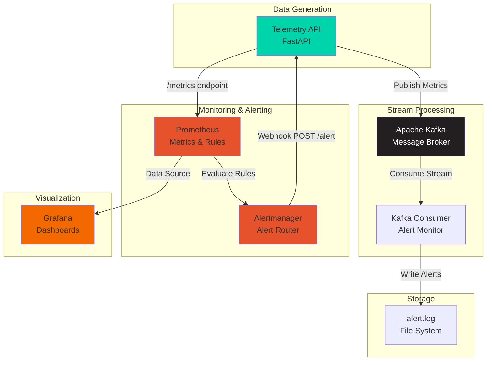

# 🌐 Network Telemetry & Alerting System

> **Open-source, production-ready telemetry monitoring and alerting platform for network devices**

A complete observability stack that simulates network device telemetry, streams data through Kafka, monitors with Prometheus, visualizes in Grafana, and provides dual-layer alerting mechanisms.

[](https://www.docker.com/)
[](https://www.python.org/)
[](https://fastapi.tiangolo.com/)
[](https://kafka.apache.org/)
[](LICENSE)

---

## 📋 Table of Contents

- [Overview](#-overview)
- [Features](#-features)
- [Architecture](#-architecture)
- [Tech Stack](#-tech-stack)
- [Quick Start](#-quick-start)
- [Setup Guide](#-setup-guide)
- [Viewing Dashboards & Alerts](#-viewing-dashboards--alerts)
- [API Documentation](#-api-documentation)
- [Configuration](#-configuration)
- [Troubleshooting](#-troubleshooting)
- [Future Improvements](#-future-improvements)
- [Contributing](#-contributing)
- [License](#-license)

---

## 🎯 Overview

This project demonstrates a **complete end-to-end observability solution** for network infrastructure monitoring. It simulates three network devices (routers) generating telemetry data, processes it through a streaming pipeline, stores metrics in a time-series database, and provides real-time alerting through multiple channels.

### Key Capabilities

- **Real-time Telemetry Generation**: Simulates 3 network devices with realistic metrics
- **Stream Processing**: Kafka-based event streaming architecture
- **Dual Alerting**: Both stream-based (Kafka Consumer) and time-series (Prometheus) alerting
- **Visualization**: Pre-configured Grafana dashboards with live updates
- **Webhook Integration**: Alertmanager sends alerts to FastAPI endpoint
- **Production-Ready**: Fully containerized with Docker Compose orchestration

---

## ✨ Features

### Core Features

- ✅ **Simulated Network Devices**: 3 routers (Router-1, Router-2, Router-3)
- ✅ **Telemetry Metrics**:
  - CPU Usage (%)
  - Network Latency (ms)
  - Packet Loss (%)
- ✅ **Auto-refresh**: Metrics generated every 5 seconds
- ✅ **Kafka Event Streaming**: Real-time data pipeline
- ✅ **Prometheus Monitoring**: Time-series metrics collection
- ✅ **Grafana Dashboards**: Pre-configured visualizations
- ✅ **Dual Alerting System**:
  - **Stream-based**: Kafka Consumer for immediate detection
  - **Time-series**: Prometheus alerts with 1-minute persistence
- ✅ **Alertmanager Integration**: Alert routing and deduplication
- ✅ **Webhook Alerts**: FastAPI endpoint receives formatted alerts
- ✅ **Health Checks**: All services monitored for availability
- ✅ **Persistent Storage**: Prometheus and Grafana data retention

### Alert Thresholds

| Metric | Threshold | Duration |
|--------|-----------|----------|
| CPU Usage | > 80% | 1 minute (Prometheus) / Immediate (Kafka) |
| Latency | > 300ms | 1 minute (Prometheus) / Immediate (Kafka) |
| Packet Loss | > 5% | 1 minute (Prometheus) / Immediate (Kafka) |

---

## 🏗️ Architecture

### System Architecture Diagram



### Component Flow

1. **Telemetry API** generates metrics every 5 seconds
2. **Kafka** receives and streams telemetry data
3. **Kafka Consumer** monitors stream for immediate alerts → `alert.log`
4. **Prometheus** scrapes `/metrics` endpoint every 5 seconds
5. **Prometheus** evaluates alert rules (1-minute persistence)
6. **Alertmanager** receives alerts and routes to webhook
7. **FastAPI `/alert`** endpoint logs Prometheus alerts
8. **Grafana** visualizes metrics from Prometheus

### Service Stack (7 Containers)

| Service | Port | Purpose |
|---------|------|---------|
| **Zookeeper** | 2181 | Kafka cluster coordination |
| **Kafka** | 9092 | Message broker for telemetry stream |
| **Telemetry API** | 8000 | FastAPI app (producer + webhook) |
| **Kafka Consumer** | - | Stream processor & alerting |
| **Prometheus** | 9090 | Metrics collection & alerting |
| **Alertmanager** | 9093 | Alert routing & deduplication |
| **Grafana** | 3000 | Visualization & dashboards |

---

## 🛠️ Tech Stack

### Backend & API
- **FastAPI** - Modern Python web framework
- **Uvicorn** - ASGI server
- **Python 3.11** - Programming language

### Streaming & Messaging
- **Apache Kafka** - Distributed event streaming
- **Zookeeper** - Kafka cluster management
- **aiokafka** - Async Kafka client for Python

### Monitoring & Observability
- **Prometheus** - Time-series database & alerting
- **Alertmanager** - Alert routing & management
- **Grafana** - Metrics visualization

### Infrastructure
- **Docker** - Containerization
- **Docker Compose** - Multi-container orchestration

### Data Format
- **Prometheus Exposition Format** - Metrics export
- **JSON** - API responses & Kafka messages

---

## 🚀 Quick Start

### Prerequisites

- Docker 20.10+
- Docker Compose 2.0+
- 8GB RAM recommended
- Ports available: 2181, 3000, 8000, 9090, 9092, 9093

### Option 1: Automated Demo (Recommended)

Run the interactive demo script:

```bash
./demo.sh
```

**What it does:**
- ✅ Builds and starts all services
- ✅ Waits for health checks
- ✅ Displays service status
- ✅ Shows API metrics
- ✅ Tails alert logs in real-time

### Option 2: Quick Start

```bash
./start.sh
```

### Option 3: Manual Start

```bash
docker-compose up -d
```

### Verify Services

```bash
docker-compose ps
```

All services should show status as `Up` and `healthy`.

---

## 📖 Setup Guide

### Step-by-Step Installation

#### 1. Clone the Repository

```bash
git clone <repository-url>
cd KafkaAutoTool
```

#### 2. Start the Stack

```bash
# Option A: Interactive demo
./demo.sh

# Option B: Background start
docker-compose up -d
```

#### 3. Wait for Initialization

Services take 30-60 seconds to become healthy on first run.

```bash
# Check service status
docker-compose ps

# View logs
docker-compose logs -f telemetry-api
```

#### 4. Verify API

```bash
# Health check
curl http://localhost:8000/health

# Get current metrics
curl http://localhost:8000/status | jq
```

#### 5. Access Web Interfaces

Open in your browser:
- **Telemetry API Docs**: http://localhost:8000/docs
- **Prometheus**: http://localhost:9090
- **Alertmanager**: http://localhost:9093
- **Grafana**: http://localhost:3000 (admin/admin)

---

## 📊 Viewing Dashboards & Alerts

### Grafana Dashboard

#### Access the Dashboard

1. **Open Grafana**: http://localhost:3000
2. **Login**:
   - Username: `admin`
   - Password: `admin`
3. **Navigate**: Dashboards → Network Device Telemetry
4. **Direct Link**: http://localhost:3000/d/telemetry-dashboard

#### Dashboard Panels

The pre-configured dashboard includes:

| Panel | Description | Threshold Indicator |
|-------|-------------|---------------------|
| **CPU Usage by Device** | Time-series graph showing CPU % for all devices | Red line at 80% |
| **Network Latency** | Latency in milliseconds over time | Red line at 300ms |
| **Packet Loss** | Packet loss percentage | Red line at 5% |
| **Current CPU Gauge** | Real-time gauge visualization | Color-coded thresholds |

**Features:**
- ✅ Auto-refresh every 5 seconds
- ✅ Shows last, max, and mean values
- ✅ Color-coded thresholds
- ✅ Interactive time range selection

### Prometheus Alerts

#### View Alert Rules

1. **Open Prometheus**: http://localhost:9090
2. **Navigate**: Status → Rules
3. **View Alerts**: Alerts tab

#### Alert States

- 🟢 **Inactive**: Condition not met
- 🟡 **Pending**: Condition met, waiting for duration (< 1 minute)
- 🔴 **Firing**: Alert active (condition met for > 1 minute)

#### Query Metrics

```bash
# Current CPU usage
curl 'http://localhost:9090/api/v1/query?query=device_cpu_usage'

# Latency over time
curl 'http://localhost:9090/api/v1/query_range?query=device_latency_ms&start=2024-01-01T00:00:00Z&end=2024-01-01T01:00:00Z&step=15s'
```

### Alertmanager UI

1. **Open Alertmanager**: http://localhost:9093
2. **View Active Alerts**: Main dashboard
3. **Silence Alerts**: Click "Silence" button
4. **View Alert History**: Check resolved alerts

### Alert Logs

#### Kafka Consumer Alerts (Real-time)

```bash
# Tail alert log
tail -f logs/alert.log

# Search for specific alerts
grep "CPU_HIGH" logs/alert.log
```

#### Prometheus Alerts (FastAPI Logs)

```bash
# View telemetry-api logs
docker-compose logs -f telemetry-api | grep "PROMETHEUS ALERT"
```

**Example Alert Output:**
```
[PROMETHEUS ALERT - FIRING] Alert: HighCPUUsage | Device: Router-1 | Severity: warning | Summary: High CPU usage detected on Router-1 | Description: Device Router-1 has CPU usage of 85.5%
```

---

## 📚 API Documentation

### Endpoints

#### `GET /`
Root endpoint with API information

**Response:**
```json
{
  "service": "Telemetry API",
  "version": "1.0.0",
  "devices": ["Router-1", "Router-2", "Router-3"],
  "kafka_enabled": true,
  "kafka_topic": "telemetry_stream"
}
```

#### `GET /metrics`
Prometheus-formatted metrics

**Response:**
```
# HELP device_cpu_usage CPU usage percentage
# TYPE device_cpu_usage gauge
device_cpu_usage{device="Router-1"} 45.23
device_latency_ms{device="Router-1"} 12.45
device_packet_loss{device="Router-1"} 0.87
```

#### `GET /status`
JSON snapshot of current metrics

**Response:**
```json
{
  "timestamp": "2025-10-13T14:30:00.000000Z",
  "devices": [
    {
      "name": "Router-1",
      "cpu_usage_percent": 45.23,
      "latency_ms": 12.45,
      "packet_loss_percent": 0.87,
      "last_updated": "2025-10-13T14:30:00.000000Z"
    }
  ]
}
```

#### `GET /health`
Health check endpoint

**Response:**
```json
{
  "status": "healthy",
  "devices_count": 3,
  "metrics_available": true,
  "kafka_connected": true
}
```

#### `POST /alert`
Webhook endpoint for Alertmanager

**Request Body:**
```json
{
  "alerts": [
    {
      "status": "firing",
      "labels": {
        "alertname": "HighCPUUsage",
        "severity": "warning"
      },
      "annotations": {
        "summary": "High CPU usage detected",
        "description": "Device Router-1 has CPU usage of 85.5%"
      }
    }
  ]
}
```

### Interactive API Docs

Access Swagger UI: http://localhost:8000/docs

---

## ⚙️ Configuration

### Environment Variables

**Telemetry API:**
```bash
KAFKA_BOOTSTRAP_SERVERS=kafka:29092  # Kafka broker address
```

**Kafka Consumer:**
```bash
KAFKA_BOOTSTRAP_SERVERS=kafka:29092  # Kafka broker address
```

### Alert Thresholds

**Kafka Consumer** (`kafka_consumer.py`):
```python
CPU_THRESHOLD = 80.0          # CPU usage %
LATENCY_THRESHOLD = 300.0     # Latency in ms
PACKET_LOSS_THRESHOLD = 5.0   # Packet loss %
```

**Prometheus Rules** (`alert_rules.yml`):
```yaml
- alert: HighCPUUsage
  expr: device_cpu_usage > 80
  for: 1m  # Must persist for 1 minute
```

### Modify Scrape Interval

Edit `prometheus.yml`:
```yaml
global:
  scrape_interval: 5s  # Change to desired interval
```

### Grafana Credentials

Default credentials (change in `docker-compose.yml`):
```yaml
environment:
  - GF_SECURITY_ADMIN_USER=admin
  - GF_SECURITY_ADMIN_PASSWORD=admin
```

---

## 🔧 Troubleshooting

### Common Issues

#### Services Not Starting

```bash
# Check logs
docker-compose logs <service-name>

# Restart specific service
docker-compose restart telemetry-api

# Rebuild and restart
docker-compose up -d --build
```

#### Port Conflicts

```bash
# Check what's using a port
lsof -i :8000

# Change ports in docker-compose.yml
```

#### Kafka Connection Issues

```bash
# Check Kafka health
docker exec -it kafka kafka-broker-api-versions --bootstrap-server localhost:9092

# List topics
docker exec -it kafka kafka-topics --list --bootstrap-server localhost:9092
```

#### No Alerts Appearing

- **Wait for thresholds**: Metrics are random, may take time to exceed limits
- **Check Prometheus rules**: http://localhost:9090/rules
- **Verify Alertmanager**: http://localhost:9093
- **Check logs**: `docker-compose logs -f telemetry-api`

#### Grafana Dashboard Not Loading

```bash
# Restart Grafana
docker-compose restart grafana

# Check provisioning
docker-compose logs grafana | grep provisioning
```

### Reset Everything

```bash
# Stop and remove all data
docker-compose down -v

# Start fresh
docker-compose up -d
```

### View Detailed Logs

```bash
# All services
docker-compose logs -f

# Specific service with timestamps
docker-compose logs -f --timestamps telemetry-api

# Last 100 lines
docker-compose logs --tail=100 prometheus
```

---

## 🚧 Future Improvements

### Planned Features

- [ ] **Multi-region Support**: Simulate devices across different regions
- [ ] **Custom Metric Types**: Add bandwidth, error rates, connection counts
- [ ] **Machine Learning**: Anomaly detection using ML models
- [ ] **Alert Channels**: Slack, PagerDuty, Email integrations
- [ ] **Historical Analysis**: Long-term trend analysis
- [ ] **Device Management UI**: Web interface to add/remove devices
- [ ] **Authentication**: JWT-based API authentication
- [ ] **Rate Limiting**: API rate limiting and throttling
- [ ] **Data Retention Policies**: Configurable metric retention
- [ ] **Export Capabilities**: CSV/Excel export of metrics

### Performance Enhancements

- [ ] **Horizontal Scaling**: Multiple Kafka partitions
- [ ] **Caching Layer**: Redis for frequently accessed data
- [ ] **Database Backend**: PostgreSQL for persistent device config
- [ ] **Load Balancing**: Multiple API instances
- [ ] **Compression**: Kafka message compression

### Observability Improvements

- [ ] **Distributed Tracing**: OpenTelemetry integration
- [ ] **Log Aggregation**: ELK stack integration
- [ ] **Service Mesh**: Istio for advanced traffic management
- [ ] **Chaos Engineering**: Fault injection testing

### DevOps & CI/CD

- [ ] **Kubernetes Deployment**: Helm charts
- [ ] **GitHub Actions**: Automated testing and deployment
- [ ] **Terraform**: Infrastructure as Code
- [ ] **Monitoring**: Uptime monitoring and SLO tracking

---

## 🤝 Contributing

Contributions are welcome! Please follow these steps:

1. Fork the repository
2. Create a feature branch (`git checkout -b feature/amazing-feature`)
3. Commit your changes (`git commit -m 'Add amazing feature'`)
4. Push to the branch (`git push origin feature/amazing-feature`)
5. Open a Pull Request

### Development Setup

```bash
# Install development dependencies
pip install -r requirements.txt
pip install -r requirements-consumer.txt

# Run tests (if available)
pytest

# Format code
black .
```

---

## 📄 License

This project is licensed under the MIT License - see the [LICENSE](LICENSE) file for details.

---

## 📞 Support

- **Documentation**: See [QUICKSTART.md](QUICKSTART.md) and [DEMO_GUIDE.md](DEMO_GUIDE.md)
- **Issues**: Open an issue on GitHub
- **Discussions**: Use GitHub Discussions for questions

---

## 🙏 Acknowledgments

Built with:
- [FastAPI](https://fastapi.tiangolo.com/)
- [Apache Kafka](https://kafka.apache.org/)
- [Prometheus](https://prometheus.io/)
- [Grafana](https://grafana.com/)
- [Docker](https://www.docker.com/)

---

## 📊 Project Stats

- **Services**: 7 containerized microservices
- **Languages**: Python, YAML, Shell
- **Lines of Code**: ~1000+
- **Docker Images**: 7
- **API Endpoints**: 5
- **Metrics Tracked**: 3 per device (9 total)
- **Alert Rules**: 3
- **Dashboards**: 1 pre-configured

---

**Made with ❤️ for the DevOps and SRE community**
